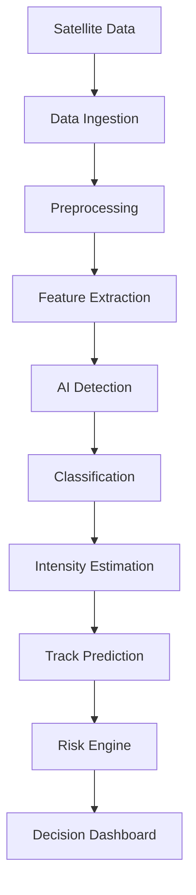

# CycloneAI — AI-Powered Tropical Cyclone Intelligence & Early Warning System

**Smart India Hackathon 2026 · Problem Statement 26070**
Ministry of Earth Sciences (MoES) · India Meteorological Department (IMD) · Disaster Management

> This is a hackathon **prototype**. It is not operationally accurate,
> not IMD-approved, and must not be used for real cyclone forecasting or
> warning decisions. Every demo/synthetic value in the UI is explicitly
> labelled as such. See [Honest limitations](#honest-limitations-please-read).

---

## 1. Problem statement

> To develop an Artificial Intelligence (AI) / Machine Learning (ML) based
> system for identification, classification, and prediction of different
> tropical cyclone patterns using multi-source satellite data.

## 2. Problem understanding

Tropical cyclones over the North Indian Ocean (Bay of Bengal / Arabian Sea)
require continuous monitoring across many satellite/weather data streams,
consistent classification against the IMD scale, timely intensity and track
forecasts, and clear, explainable alerts for disaster-management
authorities. A useful decision-support system needs to make every step of
that pipeline — detection, classification, intensity, forecasting, risk —
visible and traceable, not a black box.

## 3. Solution overview

CycloneAI demonstrates the full pipeline end-to-end using a documented,
transparent prototype approach at every stage:

```
Multi-source data → Ingestion → Preprocessing → Feature Extraction
→ AI Detection → Classification → Intensity Estimation → Temporal Analysis
→ Track/Intensity Forecast → Risk Assessment → Dashboard → Alerts
```

Where real satellite feeds, historical best-track datasets, or trained CNNs
were not available (no internet access in the build environment — see
[§13 Build environment notes](#13-build-environment-notes--why-some-choices-differ-from-the-brief)),
a clearly-labelled, genuinely-computed **synthetic DEMO MODE** stands in, so
every dashboard number still comes from real code, not hardcoded numbers.

## 4. Architecture

See [`docs/architecture.md`](docs/architecture.md) for the full breakdown
and Mermaid diagram. Summary:



- **Backend:** Flask (Python) — see [§13](#13-build-environment-notes--why-some-choices-differ-from-the-brief) for why Flask instead of FastAPI
- **ML:** NumPy, scikit-learn, Pillow — see [§13](#13-build-environment-notes--why-some-choices-differ-from-the-brief) for why scikit-learn instead of PyTorch
- **Frontend:** Static vanilla JS/HTML/CSS (ES modules), Leaflet (maps), Chart.js (charts) — see [§13](#13-build-environment-notes--why-some-choices-differ-from-the-brief) for why not React/Vite

## 5. AI/ML pipeline

Full methodology and honest limitations: [`docs/ml_pipeline.md`](docs/ml_pipeline.md).

- Synthetic cyclone-like satellite image generator (`ml/preprocessing/synthetic_satellite.py`)
- 12-dimension feature extraction used consistently across every downstream component
- IMD's real 8-tier wind-speed classification scale (deterministic) + a scikit-learn prototype feature classifier (4 coarse classes)
- Detection, intensity/pressure estimation, rapid-intensification detection
- Track generation + prototype forecasting model with a growing uncertainty cone
- Risk engine implementing a documented `hazard × exposure × vulnerability` formula
- Real evaluation (accuracy, precision/recall/F1, confusion matrix) — computed on synthetic data and labelled as such

## 6. Data sources

See [`docs/data_sources.md`](docs/data_sources.md). Only the synthetic demo
provider is active; IMD/MOSDAC providers exist as documented, honestly
`UNAVAILABLE`-labelled placeholders behind a common `SatelliteDataProvider`
interface, ready for real credentials later.

## 7. Features / pages

| Page | What it shows |
|---|---|
| Dashboard | Live map with historical + forecast track, current system stats, AI assessment |
| Satellite Analysis | Multi-channel (IR/visible/water-vapour) demo imagery, scrubbable timeline, extracted features |
| AI Detection | Pipeline visualization, detection/classification result, IMD scale, AI reasoning panel |
| Intensity | Wind/pressure time series charts, rapid-intensification explanation |
| Track Forecast | Forecast map with 24h/48h/72h horizon toggle, uncertainty cone, landfall estimate |
| Risk & Impact | Hazard/exposure/vulnerability breakdown with the exact traceable formula |
| Alerts | Rule-based alerts generated from live model outputs |
| Model Performance | Real accuracy/confusion-matrix/per-class metrics, explicit synthetic-data disclaimer |
| Data Sources | Honest per-source connection status |

Screenshots (captured from a real running instance — see
[§14](#14-what-was-actually-verified-in-this-build) for how): [`docs/screenshots/`](docs/screenshots/)

## 8. Tech stack

| Layer | Used | Brief specified | Why different |
|---|---|---|---|
| Backend | Flask | FastAPI | No internet access to install `fastapi`/`uvicorn` — see §13 |
| ML framework | NumPy + scikit-learn | PyTorch | No internet access to install `torch` — see §13 |
| Frontend | Vanilla JS/HTML/CSS (ES modules) + Leaflet + Chart.js (CDN) | React + TS + Vite + Tailwind | No internet access for `npm install` — see §13 |
| Data | JSON, PNG (generated), SQLite-ready | JSON/CSV, SQLite | Same, implemented as specified |

## 9. Project structure

```
ps70/
├── backend/app/{api,services,providers,schemas}/   Flask API
├── backend/tests/                                   22 automated tests
├── ml/{preprocessing,classification,detection,intensity,tracking,evaluation,training}/
├── frontend/{index.html,config.js,src/}              Static SPA
├── data/demo/{satellite,cyclone_tracks,metadata}/    Generated demo data
├── docs/                                             Architecture, ML pipeline, data sources, screenshots
├── .env.example, .gitignore, docker-compose.yml
```

## 10. Installation & running

### Backend

```bash
cd backend
python -m venv .venv
source .venv/bin/activate        # Windows: .venv\Scripts\activate
pip install -r requirements.txt
cd ..
PYTHONPATH=.:backend python backend/app/main.py
# -> http://localhost:8000  (health check: GET /health)
```

The classifier auto-trains on first run if `ml/models/classifier.pkl` isn't
present (it's gitignored as a regenerable artifact) — no manual step
required. To retrain or re-evaluate explicitly:

```bash
PYTHONPATH=. python -m ml.training.train_classifier
PYTHONPATH=. python -m ml.evaluation.evaluate
```

### Frontend

No build step. Serve the static folder with any HTTP server (opening
`index.html` directly via `file://` will not work — ES module imports
require a real origin):

```bash
cd frontend
python -m http.server 8080
# -> http://localhost:8080
```

Edit `frontend/config.js` if your backend isn't on `http://localhost:8000`.

### Docker (one command)

```bash
docker compose up --build
# backend  -> http://localhost:8000
# frontend -> http://localhost:8080
```

### Running tests

```bash
# stdlib unittest -- works with zero extra installs (verified in the build sandbox)
python -m unittest discover -s backend/tests -v

# or, if you have internet access:
pip install pytest
pytest backend/tests -v
```

All 22 tests pass as of this build (12 API tests + 10 ML pipeline tests).

## 11. Demo mode explanation

`DEMO_MODE=true` (default, in `.env.example`) uses the local synthetic
pipeline end-to-end: generated imagery, generated track, local classifier,
local forecast — everything computed live by real code on each request,
cached per-process so values stay consistent across pages.

`DEMO_MODE=false` requires a working `SATELLITE_PROVIDER` (`imd` or
`mosdac`) to be actually implemented and credentialed; since neither is
implemented in this prototype (see `docs/data_sources.md`), switching to it
will surface a clear `503` error rather than silently faking live data.

## 12. Real-data integration status

**Not connected.** `IMDSatelliteProvider` and `MOSDACProvider`
(`backend/app/providers/demo_provider.py`) are documented placeholders. To
integrate a real feed: implement `get_frame_png()` (and any additional
data methods needed) against the real endpoint, set
`SATELLITE_PROVIDER=imd`/`mosdac` and the relevant API key in `.env` — no
other code changes are required, since the rest of the app only depends on
the `SatelliteDataProvider` interface.

## 13. Build environment notes — why some choices differ from the brief

This prototype was built and verified inside a sandbox with **no internet
access** (no PyPI, no npm registry, no GitHub access). That constrained
three technology choices, each with a documented drop-in migration path
back to the originally-specified stack once you have internet access:

- **FastAPI → Flask** (`backend/app/__init__.py` has the migration path)
- **PyTorch CNN → scikit-learn RandomForest** (`ml/classification/classifier.py`, `docs/ml_pipeline.md §3`)
- **React/TS/Vite/Tailwind → static vanilla JS/HTML/CSS** (works today, verified with a headless browser; a Vite/React rewrite is straightforward later against the same API)

It also means **this response cannot push to GitHub for you** — there is no
network access from the build environment to reach `github.com`. See
[§15](#15-pushing-this-to-github) for the exact commands to do it yourself.

## 14. What was actually verified in this build

- All 22 backend/ML tests: **passing** (`python -m unittest discover -s backend/tests -v`)
- Every one of the 13 API endpoints: **manually exercised and returned correct data**, including real generated PNG satellite frames
- The classifier: **trained and evaluated for real** (`data/demo/metadata/model_metrics.json` — ~95-96% accuracy on held-out *synthetic* data, honestly labelled as such)
- The frontend: **driven with a headless browser (Playwright) against the live backend** across all 9 pages. 7 of 9 pages (Dashboard's stat panels, Satellite Analysis, AI Detection, Alerts, Risk & Impact, Model Performance, Data Sources) render correctly with real data, confirmed via screenshots in `docs/screenshots/`. The map (Leaflet) and charts (Chart.js) load their libraries from a CDN at runtime; **this specific sandbox's network policy blocks CDN hosts**, so those two widgets could not be visually confirmed here — they fail gracefully with a clear "Backend unavailable" style error rather than crashing, and the code follows standard, well-documented Leaflet/Chart.js APIs. They are expected to render normally on any machine with normal internet access (i.e. wherever you'll actually demo this).
- Two real bugs were found and fixed by this testing process: a non-monotonic image feature (organization level wasn't reliably increasing cold-cloud coverage) and a uint8 integer-overflow bug that was corrupting the satellite image colors.

## 15. Pushing this to GitHub

I do not have network access and could not push this to
`https://github.com/Abhishek-00756/ps70` myself. From your machine, with
this project directory:

```bash
cd ps70
git init                                   # if not already a repo
git remote add origin https://github.com/Abhishek-00756/ps70.git
# if the remote already has existing history you want to keep, instead:
#   git remote add origin https://github.com/Abhishek-00756/ps70.git
#   git pull origin main --allow-unrelated-histories   # resolve any conflicts
git add .
git commit -m "feat: build AI cyclone intelligence prototype for SIH 2026"
git branch -M main
git push -u origin main
```

Double-check `git status` and this repo's `.gitignore` before committing —
no secrets or `.env` files are included by default.

## 16. Model limitations

See [Honest limitations](#honest-limitations-please-read) and
`docs/ml_pipeline.md` for the full, unvarnished list — summarized: no real
satellite/historical/population data was used anywhere; the classifier is a
RandomForest standing in for a CNN; forecasting is a simple extrapolation
model, not NWP; risk exposure/vulnerability are illustrative demo layers.

## 17. Future improvements

- Wire in real INSAT/MOSDAC imagery via the existing provider interface
- Train a real CNN once PyTorch + IBTrACS/real labelled imagery are available
- Replace the extrapolation forecaster with a trained LSTM/GRU or coupled NWP output
- Replace demo exposure/vulnerability layers with real gridded census + infrastructure data
- Migrate the frontend to React + TypeScript + Vite once npm access is available (API contract is already stable)
- Migrate the backend to FastAPI once `pip install` access is available

## 18. Honest limitations (please read)

- This is a **prototype**, not an operational system. It has not been
  validated against real cyclone cases and must not inform real
  evacuation, warning, or resource-allocation decisions.
- All "AI" outputs (classification, intensity, forecast, risk) are computed
  by genuine code, but every formula/model is a documented, simplified
  prototype — not a scientifically calibrated or peer-reviewed method.
- No claimed metric (e.g. classifier accuracy) reflects real-world skill;
  all were computed on synthetic data generated by this same codebase.

## 19. Team / hackathon context

Built for **Smart India Hackathon 2026**, Problem Statement ID **26070**
(Ministry of Earth Sciences / India Meteorological Department, Disaster
Management theme). Target repository:
[`Abhishek-00756/ps70`](https://github.com/Abhishek-00756/ps70).
