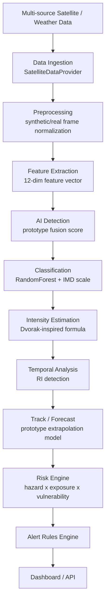

# Architecture

## System diagram



## Component layout

```
ps70/
├── backend/            Flask API (see note below on FastAPI)
│   └── app/
│       ├── api/routes.py        All HTTP endpoints
│       ├── services/            Orchestrates the ML pipeline, caches state
│       ├── providers/           SatelliteDataProvider abstraction (demo/imd/mosdac)
│       └── schemas/             Response serialization
├── ml/                 Framework-agnostic ML pipeline (importable standalone)
│   ├── preprocessing/  Synthetic imagery + feature extraction
│   ├── classification/ IMD scale + trained feature classifier
│   ├── detection/      Binary cyclone presence
│   ├── intensity/      Wind/pressure estimation + RI detection
│   ├── tracking/       Track generation + forecasting
│   ├── evaluation/     Risk engine + real metric computation
│   └── training/       Classifier training script
├── frontend/           Static vanilla JS/HTML/CSS SPA (no build step)
├── data/demo/          Generated demo imagery, tracks, and metrics
└── docs/               This documentation
```

## Why Flask instead of FastAPI, and static JS instead of React/Vite

The brief specifies FastAPI + uvicorn for the backend and React + TypeScript
+ Vite for the frontend. The environment this prototype was built and
verified in has **no internet access** (no PyPI, no npm registry, no GitHub).
`fastapi`, `uvicorn`, and every npm package required for a Vite/React build
were therefore impossible to install or verify here.

Rather than write untested code against frameworks that could not be run:

- The backend uses **Flask** (already present in the environment), with the
  exact same route layout, JSON shapes, and a documented migration path
  (`backend/app/__init__.py` docstring) to FastAPI once you have internet
  access: `pip install fastapi "uvicorn[standard]"`, wrap the existing route
  functions in an `APIRouter`, swap `jsonify`/`request` for Pydantic models.
  The service/provider/ML layers underneath do not need to change at all.
- The frontend is a **static vanilla JS/HTML/CSS single-page app** using
  native ES modules (no bundler needed), with Leaflet and Chart.js loaded
  from CDN at runtime in the browser (not at build time, so this doesn't
  require npm). It was verified end-to-end with a headless browser against
  the real backend. A React/TS/Vite rewrite is straightforward to do later
  on a machine with npm access — the API contract (`frontend/src/services/api.js`)
  is the same either way.

## Why scikit-learn instead of PyTorch

`torch` is not installed and could not be fetched either. `ml/classification/classifier.py`
uses a scikit-learn `RandomForestClassifier` over the 12-dimension engineered
feature vector instead of a CNN. The `CycloneClassifier` interface is
designed so a real CNN (PyTorch or otherwise) can be substituted later
without touching any calling code.
